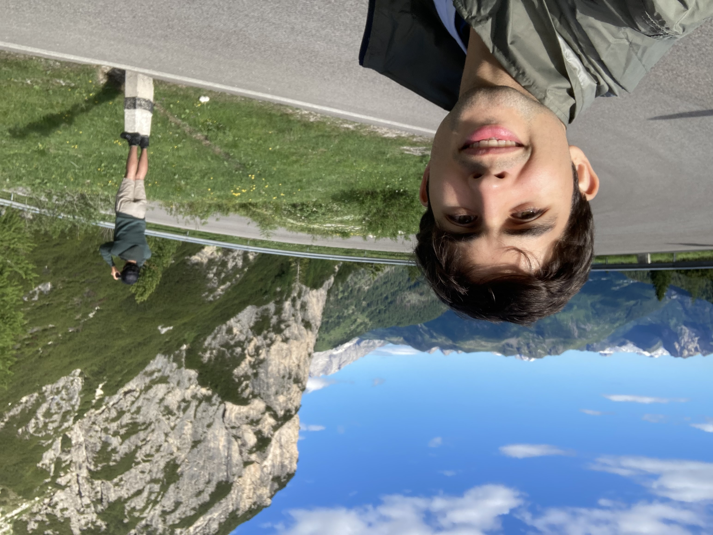
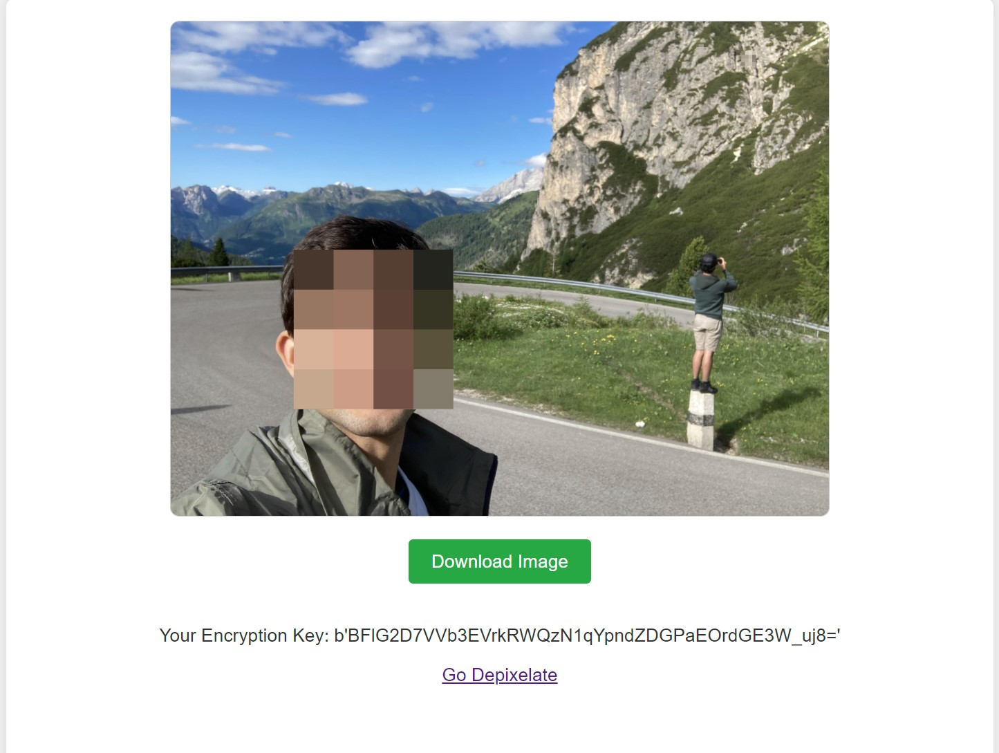

# PixelAIzer

PixelAIzer is an AI-powered video and image pixelizer that allows users to pixelate and depixelate faces within a selected region. It uses pre-trained models for face detection and algorithms with encryption methods for the pixelation and depixelization process.

## Features

1. **Face Detection**: Automatically detects faces in images and videos using AI.
2. **Pixelization**: Pixelates the detected faces or selected regions in images and videos.
3. **Depixelization**: Allows users to depixelize the pixelated regions using an encryption method.
4. **FastAPI Integration**: Includes a FastAPI setup for easy integration into web applications.

## Installation

To set up the project locally, follow these steps:

1. Clone the repository:
git clone https://github.com/AlanRoyMiller/pixelAIzer.git

2. Navigate to the project directory:
cd pixelAIzer

3. Install the required dependencies:
pip install -r requirements.txt

4. Run the application:
uvicorn app.main:app --reload

5. Open the application in your browser:
http://localhost:8000/

6. Upload image to pixelate all faces

7. You can now Download the pixelate image 

8. You can save the encryption Key if you want depixelate that same image. (Optional)

## Depixelate an image:

1. Upload the encrypted image and insert encryption key to depixelate the image.

2. You now have the original image again.

